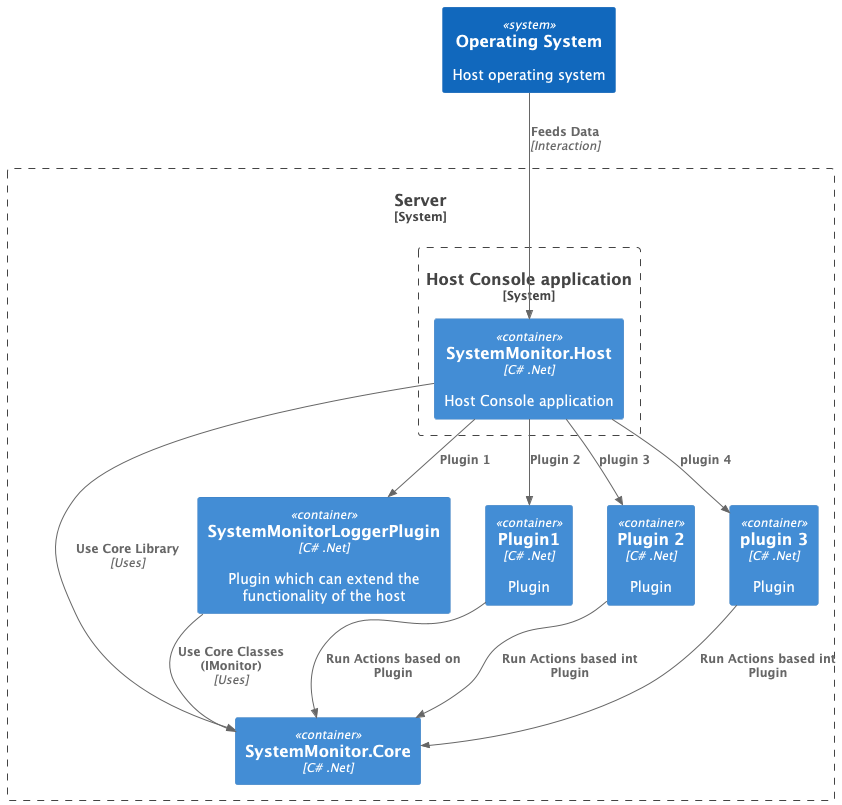

## System Performance Monitoring Application

This is a Cross Platform Console Application which Logs system Statistics to provided plugin.
Plugins can be inserted dynamically to the application.

### Architectural  And Design Decisions
1. Plugin-Architecture
   - Plugin Architecture makes the application more modular providing **self-contained** components (Plugins) for specific behaviours making system **testable**,**maintainable**.
   - Application follows **Open-Close Principle** when used plugin architecture where applications usage is open to extension but closed to modification.

   
2. SOLID principle:
   - Solid principles should always be implemented whenever a code is written it makes core more readable and maintainable.
3. Strategy Pattern:
   - This application needs some platform specific code so that it can work on multiple platforms. 
   - Using strategy pattern with interface to abstract the platform specific logic.
4. Producer Consumer Design
   - When getting stats for each interval there can be some delay while logging tha data through different mechanisms which can delay reading for next iteration.
   - Producer (in case our host app) produces data at each interval and Consumer (plugins in our case) can consume them at any rate.
5. Clean(Onion) Architecture:
   - I have used Layered Onion architecture so that services are accessed using Exposed Apis only.
   - If the Core is changed it will impact all the plugins and Host.

### Limitations Of Current Code:

1. BackPressure Issue :
   - I am using UnBounded Channels to produce the data. if this data is not consumed at a rate better than production then there can be BackPressure.
2. Manually needs to copy plugins dll to the plugins path it can be automated.


### How to Run:
1. Extract the [Downloaded Setup](https://github.com/dawarepramod4/SystemMonitor/blob/master/SystemMonitor.zip).
2. Open the folder in terminal and run following command:
```.\SystemMonitor.Host logtofile 2000```

-  `.\SystemMonitor.Host` is our application name
- `logtofile` is plugin command for logging to file, and
- `2000` represents interval in milliseconds in which to get the data (2sec)

This command will create a `log.txt` file in `Output/` directory.

3. To run for remote logger plugin:
   -  First make sure you update `appsettings.json` with proper baseUrl and path.
   - now run command: ```.\SystemMonitor.Host logtofile 2000```
   - you should see logs which states the requests send in the terminal.
